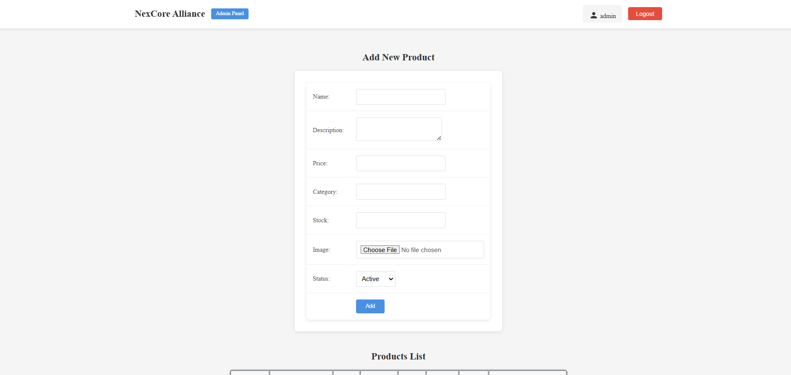

# RoleBasedLogin

A full-stack web application implementing role-based authentication and authorization with product management and shopping cart functionality.

## Features

- **Role-Based Access Control**: Supports two user roles - Admin and User
- **Authentication**: JWT-based authentication with secure password hashing
- **Product Management**: Admins can add, view, and manage products with image uploads
- **Shopping Cart**: Users can add products to cart and manage their selections
- **Responsive UI**: Built with React and Material-UI for a modern, responsive interface
- **File Upload**: Support for product image uploads using Multer

## Screenshots

_Add screenshots of your website here to showcase the UI and functionality._

Example placeholders:




## Tech Stack

### Backend

- **Node.js** with **Express.js**
- **MongoDB** with **Mongoose** ODM
- **JWT** for authentication
- **bcrypt** for password hashing
- **Multer** for file uploads
- **CORS** for cross-origin requests

### Frontend

- **React** with **Vite** build tool
- **Material-UI** for UI components
- **React Router** for navigation
- **Axios** for API calls
- **Context API** for state management

## Installation

### Prerequisites

- Node.js (v14 or higher)
- MongoDB database
- npm or yarn package manager

### Backend Setup

1. Navigate to the backend directory:

   ```bash
   cd backend
   ```

2. Install dependencies:

   ```bash
   npm install
   ```

3. Create a `.env` file in the backend directory with the following variables:

   ```
   PORT=8080
   MONGODB_URI=your_mongodb_connection_string
   JWT_SECRET=your_jwt_secret_key
   ```

4. Start the backend server:
   ```bash
   npm start
   ```

### Frontend Setup

1. Navigate to the frontend directory:

   ```bash
   cd frontend
   ```

2. Install dependencies:

   ```bash
   npm install
   ```

3. Start the development server:
   ```bash
   npm run dev
   ```

## Usage

### Default Admin Account

When the server starts, a default admin account is automatically created:

- **Username**: admin
- **Password**: admin
- **Email**: Sohebhashmiwork@gmail.com

### User Registration

1. Visit the application in your browser
2. Click on "Register" to create a new user account
3. After registration, you'll be redirected to the user dashboard

### Admin Features

- Login with admin credentials
- Add new products with images
- View all products
- Manage product inventory

### User Features

- Browse available products
- Add products to cart
- View and manage cart items
- Remove items from cart

## API Endpoints

### Authentication

- `POST /api/auth/register` - Register a new user
- `POST /api/auth/login` - Login user
- `GET /api/auth/profile` - Get user profile (protected)

### Products

- `GET /api/products` - Get all products
- `POST /api/products` - Add new product (admin only)
- `GET /api/products/:id` - Get product by ID
- `PUT /api/products/:id` - Update product (admin only)
- `DELETE /api/products/:id` - Delete product (admin only)

## Project Structure

```
RoleBasedLogin/
├── backend/
│   ├── config/
│   │   ├── DbConnection.js
│   │   ├── multerConfig.js
│   │   └── seedAdmin.js
│   ├── controllers/
│   │   ├── AuthController.js
│   │   └── ProductController.js
│   ├── middleware/
│   │   └── authMiddleware.js
│   ├── models/
│   │   ├── Product.js
│   │   └── User.js
│   ├── routes/
│   │   ├── AuthRoutes.js
│   │   └── ProductRoutes.js
│   ├── uploads/          # Uploaded product images
│   ├── package.json
│   └── server.js
├── frontend/
│   ├── public/
│   ├── src/
│   │   ├── components/
│   │   │   ├── CartSidebar.jsx
│   │   │   ├── Navbar.jsx
│   │   │   └── ProtectedRoute.jsx
│   │   ├── context/
│   │   │   ├── AuthContext.jsx
│   │   │   └── CartContext.jsx
│   │   ├── pages/
│   │   │   ├── Admin.jsx
│   │   │   ├── Login.jsx
│   │   │   ├── Register.jsx
│   │   │   └── UserPage.jsx
│   │   ├── App.jsx
│   │   └── main.jsx
│   ├── package.json
│   └── vite.config.js
└── README.md
```

## Contributing

1. Fork the repository
2. Create a feature branch
3. Make your changes
4. Test thoroughly
5. Submit a pull request

## License

This project is licensed under the MIT License.
